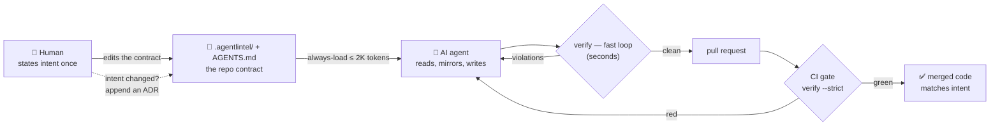
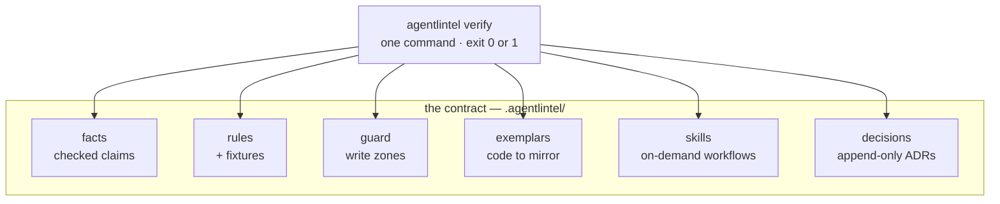

# AgentLintel

**Tell your codebase its architecture once. Every AI agent, every session,
every model builds to it — or the pull request fails.**

AgentLintel is a fair-source framework for repositories where humans and AI
coding agents work together. You state your architecture one time, as a small
machine-verified contract inside the repo. Agents read it, mirror it, and get
deterministic feedback in seconds; CI fails any pull request that violates it.
The result is a reproducible merge gate for architectural drift across prompts,
sessions, models, and context windows — without you repeating yourself in
every review.

It rides the open standards agents already read — `AGENTS.md` for always-load
guidance, `SKILL.md` for on-demand workflows — and adds the missing half:
enforcement. It works with Claude Code, Cursor, Codex, GitHub Copilot, and any
other AI coding agent that honors `AGENTS.md` or a one-line pointer from its
native instruction file. And it is deliberately unopinionated: AgentLintel
enforces *your* architecture — vertical slices, layers, MVVM, or your own
in-house convention — in any language. Built-in engines provide a deterministic
syntactic floor; the `external` engine is the primary path for semantic,
AST-aware, or stack-native checks from tools your team already trusts.

That is the moat: fixture-backed, deterministic architecture gates for the
portable floor, with external engines for native depth. Prompt files, memory,
and retrieval can help agents remember; AgentLintel decides what can merge.

The deterministic architecture gate is the mechanism. Durable, accurate
human–AI collaboration is the mission.

**Status:** `v2.0.0-alpha.8` · **License:** Fair Source ([FSL-1.1-ALv2](LICENSE); templates and contract formats [Apache-2.0](LICENSE-APACHE)) · **Requires:** Node.js >= 18

## The problem: AI coding agents drift

> In today's world, avoiding AI agents for coding is no longer realistic. They
> help, but they are also known for creating architectural differences across
> prompts and sessions. Limited context windows and memory make this worse. I
> built AgentLintel after running into this many times while working on large
> production-grade solutions. It is my way of tackling the problem, alongside
> many others trying to solve similar issues.

The failure has a pattern. Teams that pair humans with AI agents hit three
walls:

1. **Instructions do not persist.** You explain the architecture in a prompt.
   Ten sessions later — new chat, new model, compacted context — the agent
   invents a second error-handling style or a fourth folder convention.
2. **Instruction files are advisory.** Cursor rules, Copilot instructions, and
   plain `AGENTS.md` prose improve behavior but guarantee nothing: recent
   research measured instruction files dropped from the prompt roughly a third
   of the time, and 61–79% compliance on complex constraints
   ([arXiv:2512.18925](https://arxiv.org/abs/2512.18925)). Advice alone
   drifts.
3. **Hand-maintained context rots.** Architecture docs and metadata written
   for agents go stale silently — and then agents follow the stale version
   faithfully.

Drift compounds. Humans end up restating the same intent in every session and
relitigating it in every review — the opposite of the leverage agents were
supposed to bring.

## The idea: instruct once, enforce always

AgentLintel moves architectural intent out of chat history and into a contract
the repository itself carries. The contract has three properties prose never
has:

- **Verified.** Every claim about the repo is re-checked on every run. A stale
  instruction is a red build, not a silent lie.
- **Deterministic.** Rules are executed by engines, not judged by a model.
  Same input, same verdict, exit code `0` or `1`. No scores, no vibes.
- **Enforced.** CI runs the same gate and fails the pull request. An
  instruction an agent could ignore becomes a diff that cannot merge.

Core law: **every governance artifact is machine-verified, append-only, or
deleted.** Nothing in the contract can rot, because nothing unverifiable is
allowed to exist.



Why this improves agent accuracy, mechanically:

- **Nothing depends on memory.** The always-load surface stays under ~2K
  tokens, so your architecture survives every context window. Deeper
  workflows load on demand as Agent Skills.
- **Mirroring beats recall.** Agents copy a registered exemplar — real,
  canonical code in your repo — instead of reconstructing your conventions
  from prose.
- **Feedback lands in seconds.** The fast verify loop tells the agent exactly
  which rule it broke, with file and line, while it is still working — so it
  self-corrects before a human ever reviews.
- **Truth cannot rot.** Facts are re-verified on every run, exemptions expire
  on a date, and weakening a rule requires a written decision in the same
  diff.

You will still change your mind — architecture evolves. You just do it once,
in one place, as an append-only decision record (ADR), and every future
session inherits the update.

## Quick start

```bash
npm i -D https://github.com/lishan-fernando/AGENTLINTEL/releases/download/v2.0.0-alpha.8/agentlintel-cli.tgz
npx agentlintel init      # scaffold the contract (pick a pattern pack)
npx agentlintel verify    # run the gate locally
npx agentlintel explain --path src/example.ts  # debug what applies to a file
```

`init` offers pattern packs — `vertical-slice`, `layered-3tier`, `mvvm`, or
`custom` — plus optional glue: `--adapters`, `--hooks`, `--engine-adapters`,
and `--from-v1` for migrating v1 kits.

First-afternoon checklist:

1. Fill `facts.yaml` with the claims agents must never get wrong.
2. Register one exemplar — the existing code that best shows your
   conventions.
3. Trim the starter rules to the ones you actually believe.
4. Wire CI with `agentlintel verify --strict`.

From then on, the contract changes only when your intent changes.

## Inside the contract: six concepts

AgentLintel's whole surface is six concepts. Rejecting a seventh is a design
law, so the contract stays learnable in minutes — by humans and by agents.



| Concept | File | Question it answers | How it is checked |
|---|---|---|---|
| **facts** | `facts.yaml` | What is true about this repo? | Every claim re-verified on every run; stale facts fail the gate |
| **rules** | `rules.yaml` | What must never regress? | Deterministic engines fail the PR; every rule ships pass/fail fixtures proving it works |
| **guard** | `guard.json` | Where may changes land? | Changed files checked against allowed write zones |
| **exemplars** | `exemplars.yaml` | What does good look like? | Registered canonical code; agents mirror it instead of guessing |
| **skills** | `skills/` | How do we do X here? | Standard `SKILL.md` workflows, loaded only when relevant |
| **decisions** | `decisions/` | Why is it this way? | Append-only ADRs; weakening any rule requires one in the same diff |

Three reference skills ship with the framework: `strangler-extraction` (carve
capabilities out of a monolith), `mirror-exemplar` (build new code by copying
the registered exemplar), and `audit-architecture` (audit the codebase for
drift).

## Rules and engines

**A rule is only a rule if a machine can fail a pull request over it.**
Everything else is advice, and advice lives in `AGENTS.md` as one-line
principles — with no enforcement pretense.

AgentLintel has no architecture opinion of its own. Vertical slices, layered
3-tier, MVVM, hexagonal, or the in-house convention only your team uses — the
framework is the enforcement layer, and your architecture is configuration in
plain files you own: `rules.yaml` (what must hold), `guard.json` (where
changes may land), `exemplars.yaml` (what good looks like).

Pattern packs are starting templates, nothing more:

| Pack | Seeds rules like |
|---|---|
| `vertical-slice` | Capability slices: imports only through each slice's public surface, boundary validation, stable slice-local error codes |
| `layered-3tier` | Downward-only dependencies: presentation → business → data, no layer skipping, no upward imports |
| `mvvm` | Views bind ViewModels, ViewModels use Models; Views never touch Models |
| `custom` | No architecture at all — a documented skeleton for your own rules, with `engine: external` examples |

Every pack shares the same two universal safety rules — never log secrets,
and exemptions must be audited (reason, approver, owner, expiry). Everything
a pack generates is yours to edit, replace, or delete: keep the rules you
believe, because an unenforced rule nobody holds is noise.

Engines: `regex`, `layers` (declarative dependency boundaries),
`error-codes`, `exemptions` (audited escape hatches with approver, owner, and
expiry), and `external` — which wraps any repo-native checker (architecture
tests, dependency-cruiser, `dotnet test`, commit and PR policies) behind the
same gate. Treat `regex` and `layers` as a portable starter floor, not a type
system or security scanner. `external` is the language-agnostic path for deep
checks: if your stack can check it, AgentLintel can enforce it and surface it to
agents under stable rule ids.

Rule changes are ratcheted: tightening is free, but deleting, weakening, or
narrowing a rule requires an ADR in the same diff. Guardrails cannot erode
silently.

## Running the gate

Two loops, one gate:

```bash
# Inner loop — agents run this while working (seconds, diff-scoped)
npx agentlintel verify --diff --quiet --bail --no-run --skip-fixtures

# Outer loop — the CI merge gate (full, strict)
npx agentlintel verify --strict
```

GitHub Actions:

```yaml
- uses: actions/checkout@v4
- uses: lishan-fernando/AGENTLINTEL/.github/actions/agentlintel@v2
  with:
    strict: "true"
```

Exit codes are the contract: `0` gate passed, `1` gate failed, `2` internal
error. `agentlintel report` renders the same checks as a Markdown summary
(facts freshness, violations, fixtures, guard, ratchet) for humans and
dashboards. Multi-repo workspaces aggregate with `verify --workspace`.

## Is AgentLintel right for your project?

Adopt it when:

- Humans and AI agents will both commit to this codebase for months, not days.
- You have architecture opinions worth defending — boundaries, error
  contracts, module shapes — and you are tired of restating them every
  session.
- More than one agent, model, or person touches the code, and consistency
  across all of them is the actual problem.
- You run CI and can fail a pull request.

Skip it, for now, when:

- The project is a prototype you will throw away. Drift does not matter
  there.
- You have no CI and no plan for it. Without a merge gate you get only the
  advisory half, and advisory prose is the problem AgentLintel exists to fix.
- You want a tool that designs your architecture or orchestrates your agents.
  AgentLintel governs what agents produce; it does not produce.
- You expect a replacement for linters, tests, or code review. It sits beside
  them; it does not absorb them.

What adoption costs, honestly: one afternoon to state your intent (fill facts,
register an exemplar, trim rules, wire CI), and one ADR each time that intent
changes. That is the whole ongoing tax — the point is that you never again pay
the per-session re-explaining tax.

## AgentLintel alongside the tools you already use

AgentLintel replaces none of your existing quality stack. It occupies a layer
that was empty: deterministic architecture enforcement that agents can read.

| You already have | It gives you | AgentLintel adds |
|---|---|---|
| Linters and formatters (ESLint, Ruff, ...) | Per-file syntax and style | Cross-file architecture: module and layer boundaries, public surfaces, error contracts |
| Architecture test tools (ArchUnit, dependency-cruiser, NDepend) | Deep language-specific dependency analysis | Keep them — wire them in as `engine: external` rules; they gain fixtures, audited exemptions, agent visibility, and one CI gate |
| AI code reviewers (CodeRabbit, Greptile, ...) | Probabilistic judgment — thorough, but variable | The deterministic floor beneath them: zero-variance verdicts on the rules that must never regress, in the same PR |
| Instruction files (Cursor rules, Copilot instructions, plain `AGENTS.md`) | Advice the agent usually follows | The enforcement half: a machine that fails the PR when advice gets dropped |

## What AgentLintel is not

Scope is a feature. AgentLintel is not an agent orchestrator, an instruction
compiler, a static-analysis replacement, a code-review replacement, a
certification scheme, a token meter, or a hosted telemetry service. It is
metadata plus a CLI — no runtime, no model calls, no lock-in: delete
`.agentlintel/` and you have exactly the repo you had before.

The claim today, stated precisely: AgentLintel makes architecture instructions
durable, visible to agents, and enforceable in CI.

## Repository map

| Path | What |
|---|---|
| [SPEC.md](SPEC.md) | The normative v2 spec (<= 500 lines) |
| [.agentlintel/](.agentlintel/) | This repo's own contract — AgentLintel governs itself |
| [tools/agentlintel-cli/](tools/agentlintel-cli/) | The CLI: `init`, `verify`, `report`, `explain` — plain Node.js, one dependency |
| [docs/](docs/) | Adoption playbook, design rationale, evaluations |

This repository dogfoods the governance mechanics: the six concepts above are
live here, the CLI is fixture-tested, and CI runs `verify --strict` on every
pull request. It is not itself a production vertical-slice application; the
slice-shaped reference rules stay as conformance-backed starter rules —
reported as dormant by `verify` on every run — until an adopter repo flips
them to `must_match: true`.

## Status

`v2.0.0-alpha.8`, fair source, Node.js >= 18. Free to use and to build your
own software with: everything `init` scaffolds into your repo is
[Apache-2.0](LICENSE-APACHE), and the core is [FSL-1.1-ALv2](LICENSE) — any
use except selling AgentLintel itself, with each release becoming Apache-2.0
open source two years after publication
([LICENSE-POLICY.md](LICENSE-POLICY.md) has the one-page map). The
six-concept contract is stable by law; CLI surface changes require an accepted
ADR and must not add kernel concepts.
File formats may still see minor changes before `v2.0.0`. Feedback and drift
war stories are welcome in the issue tracker.
